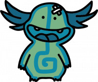
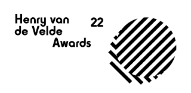
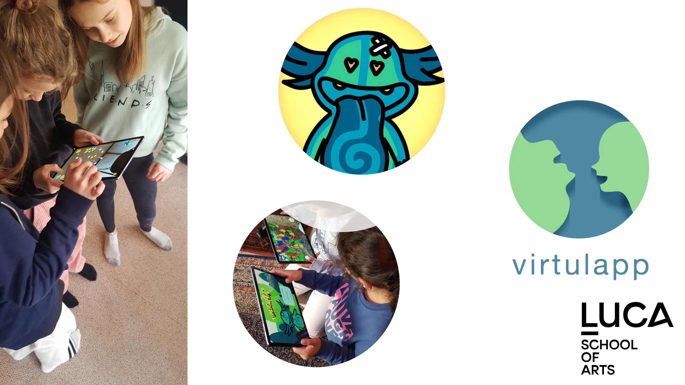
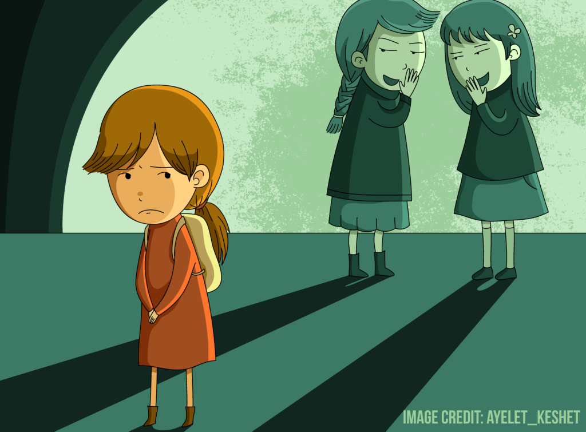
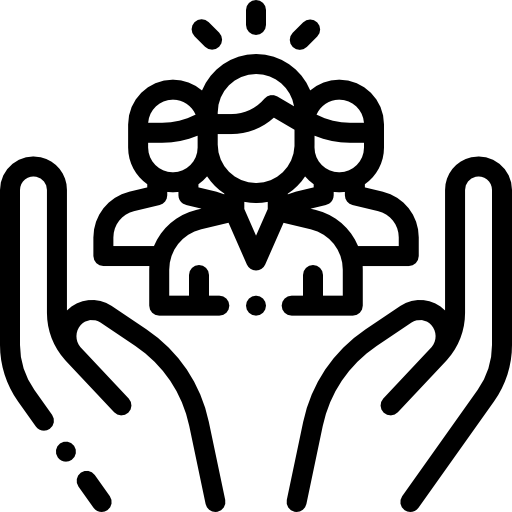

# lerend netwerk Arts Based Research

## LUCA

Meeting 25/04/2022 LUCA Gent

<!-- 
  1. Hoe wordt kunst en design ingezet in onderzoek?
  2. wat betekent kunst in onderzoek? 
  3. art based research netwerk binnen praktijkgebaseerd onderzoek, waarom komen ze tot bij ons om creatieve kunst in te zetten in research: creative and artistic skills. 
  4. immersieve omgeving als extra voor geloofwaardigheid, storytelling, ...
  5. De game-omgeving en creative storytelling approach 
-->

--- 

## topics

1. Polymath lab
2. BabelAR <!--https://docs.google.com/presentation/d/1bUIL82ro1EIso9SZqvoJfxPGN7ETAxMsVLvuQK2gd0I/edit#slide=id.p2 -->
3. TrustVR

---

wie ben ik: creative engineer, keuze als engineer om juist binnen 

---

<!-- https://henryvandevelde.be/nl/awards/22/babelar -->

---

## BabelAR

==> welke partners waren in dit project, consortium

<!-- De Polymath meerwaarde is dat we associatiever kunnen conceptualiseren door artistieke en technologische context -->
<!--  -->

- Erasmus+ project 'virtual language app'
<!-- - oorsprong: noden van leerkrachten bij multilinguale educatie, kennisopbouw van en creeren van tools voor multilinguale educatie: hoe kunnen kinderen zelfstandig collaboratief leren in een multilinguale omgeving, hoe kunnen leerkrachten dit faciliteren en gaan ze hiermee om. -->
- een meertalige, multi-player Augmented Reality game. 
- Henry van de Velde Awards 

  <!-- - Doel: spelenderwijs kinderen van 7-12 tonen wat de waarde van hun taal/talen is en hoe ze die talenkennis kunnen activeren. 
  - Multilingualiteit hoeft geen hindernis te zijn -->
--- 

---

---

---

---

[BabelAR film](https://vimeo.com/473359440)

--- 

oorsprong consortium CoHack Reality

# consortium virtulapp

---

---

### Rol van LUCA - inzet arts-based research

- idee - concept - realisatie
- visual first aanpak: 
  - interactieve AR omgeving
  - game-ontwikkeling ism research:
  <!-- - creatieve aanpak voor betrokkenheid van de kinderen
  - iteratief proces: in samenwerking met zowel de kinderen, leerkrachten als onderzoekers.  -->
- game: groot bereik
  - meer feedback 
  - impact & gekendheid
<!-- - geheel mogelijk door link artistieke en technologische context -->

--- 

## TrustVR

- samenwerking KULeuven Psychologie en LUCA
- hechtingsproblematiek bij kinderen (9-12)
  - invloed van Oxytocine op hechting?

---

### doel

immersieve opstelling :
  - VR-omgeving
  - data-captatie: 
    - EEG, GSR, eye-tracking, questionnaires
  - rollenspel: Cyberball

---

### Rol van LUCA

==> niet enkele technical expertise, hoe kunnen we het creatieve potentieel van tech ontsluiten
==> voordeel van de creatieve oplossing: researchers stellen grenzen op, wij zorgen voor unieke beleving, die toch aanpasbaar genoeg is, geloofwaardig en evenzeer verwonderlijk. 
==> kunst is niet enkel inkt+krijt
==> waarom niet gewoon een gamehuis ==> interactie aangaan, ontbreken van kennis is aan beide kanten zo, laten we leren van elkaar. 

- ontwikkeling spelomgeving + integratie sensoren
- user story uitschrijven in functie van onderzoek KUL ==> creative occupation
- samen kijken met KUL voor meerwaarde dmv Virtual Reality
  - game development
  - 3D modelling voor de 'suspension of disbelief'
  - design process

---